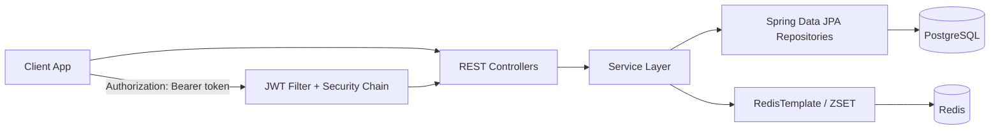
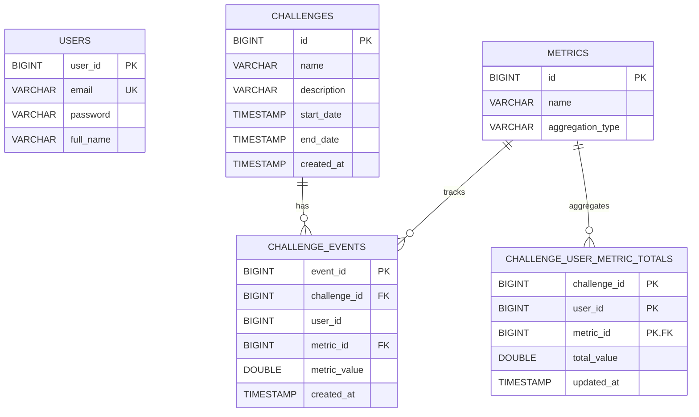

# Workout Leaderboard Backend

A Spring Boot backend for tracking workout challenge progress and serving real-time leaderboards.

The service supports:
- User signup/login with JWT-based authentication.
- Event-based score submission per challenge/user/metric.
- Aggregated leaderboard totals.
- Fast leaderboard reads from Redis sorted sets.

## Project Description

This project models fitness challenges (for example, steps, calories, distance) where users submit score events over time. Each new event updates:
- The event history (`challenge_events`).
- The latest aggregated total (`challenge_user_metric_totals`).
- The Redis leaderboard cache (`challenge:{challengeId}:leaderboard`).

This hybrid approach gives:
- Durable history and aggregation state in PostgreSQL/JPA.
- Fast rank retrieval from Redis.

## Tech Stack

- Java 21
- Spring Boot 4.0.2
- Spring Web MVC
- Spring Data JPA (PostgreSQL)
- Spring Data Redis + Jedis
- Spring Security + JWT (`jjwt`)
- Gradle
- JUnit 5 + Mockito

## Architecture

### High-Level Components

- `controller`: HTTP endpoints and request validation.
- `service`: Business logic (auth, score submission, aggregation, leaderboard reads).
- `repository`: JPA repositories for persistence.
- `security`: JWT token provider + authentication filter.
- `config`: Security, Redis, and CORS configuration.
- `initializer`: Boot-time seed data for metrics/challenges/events/totals.
- `exception`: Centralized error handling and API error responses.

### Layered Request Flow



### Score Submission Flow

`POST /submit-score` performs:
1. Request validation (`eventId`, `challengeId`, `userId`, `metricId`, `value` required).
2. Challenge and metric existence checks.
3. Event insertion into `challenge_events`.
4. Re-aggregation of all events for `(challengeId, userId, metricId)`.
5. Upsert of aggregated value in `challenge_user_metric_totals`.
6. Redis ZSET update for fast ranking.

## Database Model

The domain is implemented with five core tables/entities.



### Entity Notes

- `ChallengeEvent` stores immutable event history.
- `ChallengeUserMetricTotal` stores latest aggregate by composite key:
  - `(challenge_id, user_id, metric_id)`.
- Redis key format for ranking cache:
  - `challenge:{challengeId}:leaderboard`
  - member format: `{userId}:{metricId}`
  - score: aggregated value.

## Security Model

- Public endpoints:
  - `POST /auth/login`
  - `POST /auth/signup`
  - `GET /leaderboard/challenges`
  - `GET /leaderboard/challenge/{challengeId}`
- All other endpoints require JWT bearer token.
- JWT includes:
  - subject: user email
  - claim: `fullName`

## API Overview

### Auth

- `POST /auth/signup`
  - Body: `{ "fullName", "email", "password" }`
  - Returns token + user info.

- `POST /auth/login`
  - Body: `{ "email", "password" }`
  - Returns token + user info.

### Leaderboards

- `POST /submit-score` (authenticated)
  - Body: `{ "eventId", "challengeId", "userId", "metricId", "value" }`
  - Returns event id + new aggregated score.

- `GET /leaderboard/challenges` (public)
  - Returns all challenges.

- `GET /leaderboard/challenge/{challengeId}` (public)
  - Returns ranked leaderboard entries.

- `GET /leaderboard/challenge/{challengeId}/user/{userId}` (authenticated)
  - Returns all metric totals for that user in a challenge.

## Error Handling

A global exception handler returns structured error payloads with:
- HTTP status
- internal error code
- message
- request path

Mapped exceptions include:
- `BadRequestException` -> `400`
- `UnauthorizedException` -> `401`
- `ResourceNotFoundException` -> `404`
- `ConflictException` -> `409`
- generic/server exceptions -> `500`

## Project Setup

### 1. Prerequisites

- JDK 21
- Docker
- Redis running locally on port `6379`
- Unix shell (Linux/macOS) or equivalent Windows setup

### 2. Clone

```bash
git clone https://github.com/ANR22/workout-leaderboard-backend.git
cd workout-leaderboard-backend
```

If your local folder name is `leaderboard`, run commands from that directory.

### 3. Start Infrastructure (Redis + PostgreSQL)

Use Docker Compose (includes a named volume for PostgreSQL persistence):

```bash
docker compose up -d
```

This creates:
- `postgres` on `localhost:5432`
- `redis` on `localhost:6379` (if already running elsewhere, adjust compose as needed)
- `postgres_data` named volume mounted to `/var/lib/postgresql/data`

### 4. Configure Application (optional)

Default config is in `src/main/resources/application.properties`:
- PostgreSQL (`jdbc:postgresql://localhost:5432/leaderboard`)
- Redis host `localhost:6379`
- JWT secret and expiration

You can override by environment variables or profile-specific properties.

### 5. Run the App

```bash
./gradlew bootRun
```

Server defaults to `http://localhost:8080`.

### 6. Verify Build and Tests

```bash
./gradlew clean build
```

Run only tests:

```bash
./gradlew test
```

### 7. Verify PostgreSQL Persistence

1. Start the app and submit data.
2. Stop app + containers.
3. Start again with `docker compose up -d` and `./gradlew bootRun`.
4. Data remains because PostgreSQL uses `postgres_data` volume.

## Seed Data

On startup, `DataInitializer` inserts:
- 4 metrics
- 3 challenges
- multiple challenge events
- precomputed totals for sample users

The initializer is kept enabled and is idempotent: it seeds only when the database is empty.

## Example cURL

Signup:

```bash
curl -X POST http://localhost:8080/auth/signup \
  -H "Content-Type: application/json" \
  -d '{"fullName":"Ada Lovelace","email":"ada@example.com","password":"secret123"}'
```

Login:

```bash
curl -X POST http://localhost:8080/auth/login \
  -H "Content-Type: application/json" \
  -d '{"email":"ada@example.com","password":"secret123"}'
```

Submit score (replace `<TOKEN>`):

```bash
curl -X POST http://localhost:8080/submit-score \
  -H "Authorization: Bearer <TOKEN>" \
  -H "Content-Type: application/json" \
  -d '{"eventId":2001,"challengeId":1,"userId":1,"metricId":1,"value":5000.0}'
```

Get challenge leaderboard:

```bash
curl http://localhost:8080/leaderboard/challenge/1
```

## Project Structure

```text
src/main/java/com/workout/leaderboard/
  config/         # security, CORS, redis beans
  controller/     # auth + leaderboard REST endpoints
  dto/            # request/response payloads
  entity/         # JPA entities and composite key classes
  exception/      # custom exceptions + global handler
  initializer/    # startup seed data
  repository/     # Spring Data repositories
  security/       # JWT provider and request filter
  service/        # core business logic
```

## Notes

- Runtime datasource is PostgreSQL with `spring.jpa.hibernate.ddl-auto=update`.
- Tests use in-memory H2 via `src/test/resources/application.properties` for fast local and CI builds.
- Leaderboard read endpoint accepts `limit` query parameter but currently returns all ranked entries.
- For production, use persistent database, stronger secret management, and stricter CORS rules.
